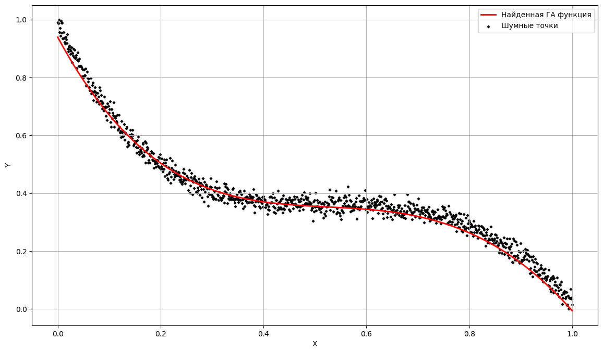

# Лабораторная работа 3 -  Genetic Algorithm

## Описание 
В данной лабораторной работе реализован генетический алгоритм с использованием GPU для аппроксимации функции полиномом 4-го порядка на основе набора точек. Итогом работы программы является время выполнения на GPU, набор коэффициентов полинома, наилучшее значение фитнес-функции и количество итераций.

Входные параметры программы включают:

- Имя файла с точками данных
- Размер популяции
- Среднее значение мутации
- Дисперсия мутации
- Максимальное количество итераций
- Максимальное количество итераций без улучшений

## О реализации

- Структура `Individual` представляет индивида (решение задачи) в виде коэффициентов полинома 4-го порядка.
- Функция `fitness` вычисляет ошибку аппроксимации для заданного индивида, используя квадратичную ошибку между вычисленным значением функции и заданными точками.

- *Ядра CUDA*:
  - `init_random_state` инициализирует генератор случайных чисел для каждого потока.
  - `generate_population` генерирует начальную популяцию случайных коэффициентов полинома.
  - `mutate_population` выполняет мутацию, случайным образом изменяя коэффициенты с заданной вероятностью.
  - `crossover_population` выполняет кроссовер между двумя родителями, копируя коэффициенты от одного индивида к другому.
  - `evaluate_fitness` вычисляет ошибку для всех индивидов популяции.
  - `select_best_individual` находит индивида с наименьшей ошибкой аппроксимации.

- *Основной цикл*:
  - Оценка ошибок всех индивидов.
  - Селекция лучшего индивида на основе наименьшей ошибки.
  - Кроссовер и мутация популяции для создания нового поколения.
  - Программа продолжает работать до достижения максимального количества итераций или до тех пор, пока не перестанет улучшаться результат.

Программа использует CURAND для генерации случайных чисел на GPU, для случайной инициализации популяции, выполнения мутации и выбора родителей при кроссовере. 

Thrust используется для переноса и управления массивами точек между хостом и устройством.

## Запуск программы

При запуске программы указывается путь к файлу с точками, размер популяции, параметры мутации, количество итераций и итераций без улучшений:

`./genetic_approximation points.txt population_size mutation_mean mutation_variance max_iter max_const_iter
`

## Результаты работы программы

Запуск программы выполнялся в Google Colab.

Для создания шумных данных используется полином четвертой степени:

$y = 2 - x + 0.5x^2 - 0.5x^3 + 0.01x^4$.

На основе данного полинома генерируется набор точек (data.txt) с добавлением случайного шума. После этого точки нормализуются для приведения их значений к единому масштабу. Полученные нормализованные данные используются в качестве входных значений для программы.

Параметры запуска и вывод программы:

`./genetic_approximation data.txt 2000 0.9 0.7 10000 1000`

Вывод для примера выше:

Best fitness: 0.666415

Best coefficients: 0.93952 -3.29461 6.55759 -5.01655 0.808007 

Number of iterations: 10000

Time on GPU: 7314.47 ms

Ниже представлена визуализация аппроксимации полинома, полученная в результате применения генетического алгоритма к шумным данным.

