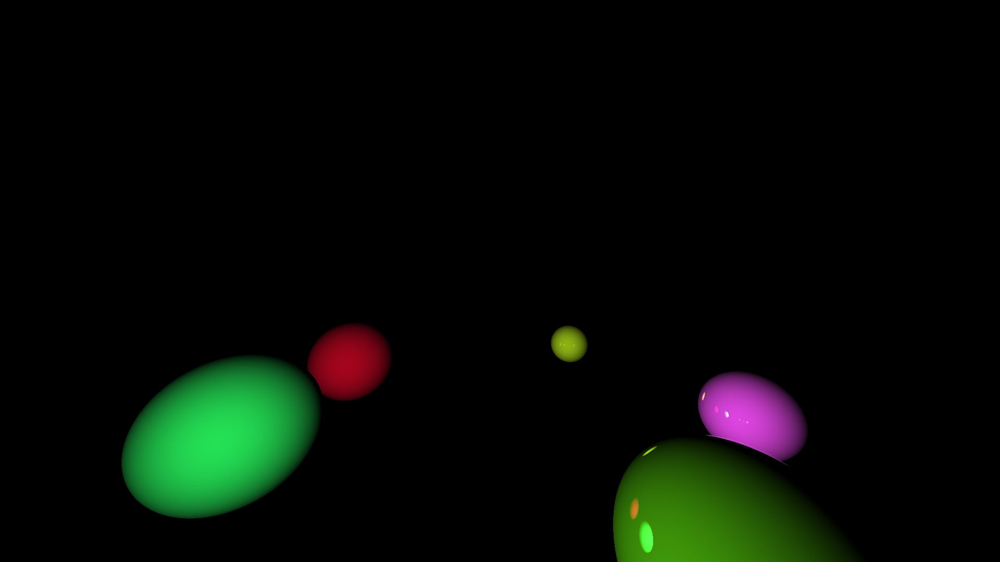
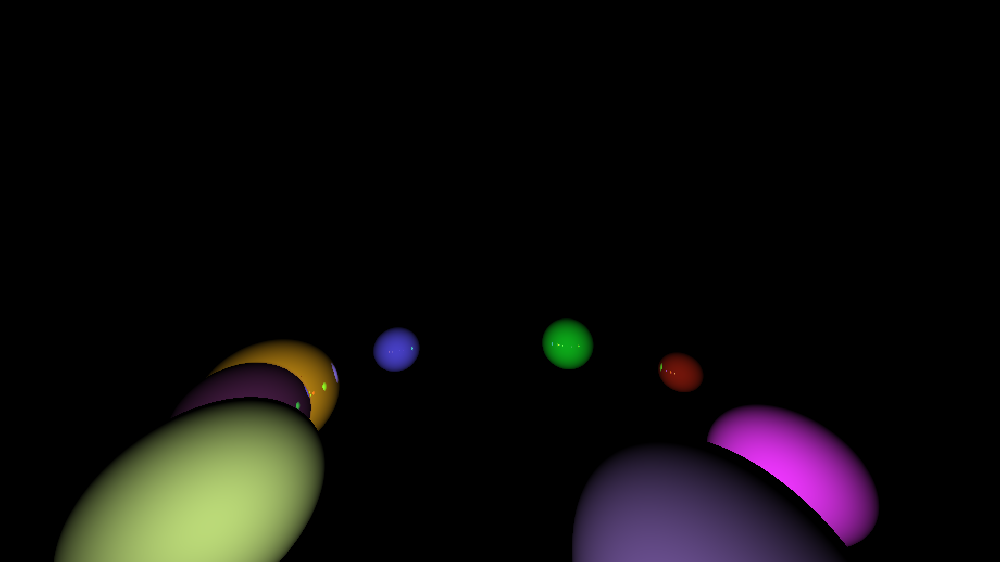
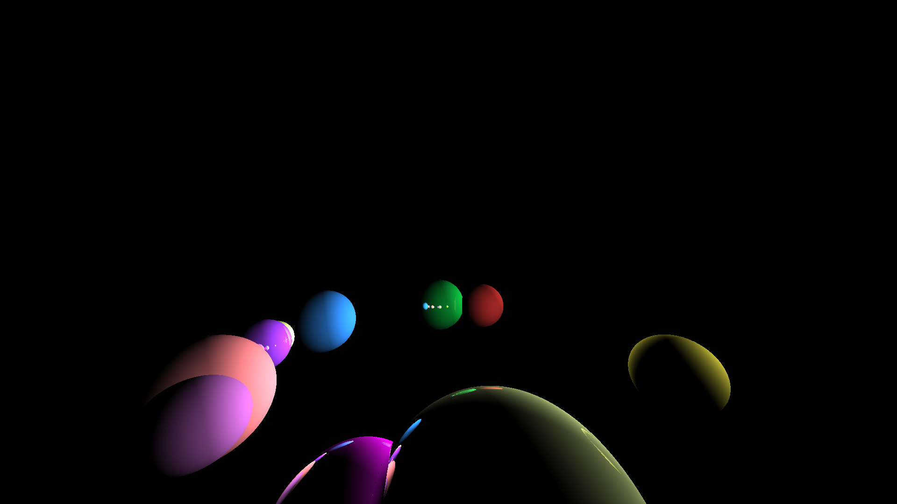

# Лабораторная работа 3 - Ray Tracing on GPU

## Описание 
В данной лабораторной работе реализован алгоритм Ray Tracing с использованием GPU для визуализации 3D-сцен. Итогом работы программы является время создания изображения и само изображение, сохраненное в формате BMP.

Входные параметры программы включают:

- Количество сфер в сцене
- Количество источников света
- Разрешение изображения (ширина и высота)
- Имя выходного файла

## О реализации

- Класс `Vec3` описывает трехмерные векторы и предоставляет методы для арифметических операций, нормализации и скалярного произведения.
- Класс `Sphere` определяет сферы с центром, радиусом, цветом и свойством отражения. Содержит метод лля проверки пересечения луча с поверхностью сферы.
- Функция `traceRay` представляет собой основной алгоритм для трассировки лучей. Она определяет пересечение луча с объектами сцены, вычисляет освещение в точке пересечения и обрабатывает отражения, если сфера отражающая.

- *Генерация сцены*:
  - Радиусы сфер выбираются случайно из заданного диапазона.
  - Цвет сферы и свойство отражения выбираются случайно.
  - Координаты сфер выбираются случайно и располагаются на окружности чтобы иметь возможность увидеть каждую сферу.
  - Координаты источников света также выбираются случайно на внешней окружности.
  - Координаты камеры фиксированы.
 
- Основная функция ядра CUDA `renderImage` брабатывает каждый пиксель изображения.
- Для каждого пикселя вычисляется направление луча, который трассируется через сцену.
- Результирующий цвет записывается в массив пикселей.

Готовое изображение сохраняется в формате BMP с использованием библиотеки EasyBMP (https://github.com/izanbf1803/EasyBMP.git).

## Запуск программы

При запуске программы указывается число сфер, число источников света, ширина, высота и имя изображения:

`./ray_trace <numSpheres> <numLights> <width> <height> <imagename>`

Пример для 10 сфер, 2 источников света, разрешения 1920x1080, с названием "output.bmp":

`./ray_trace 10 2 1920 1080 output.bmp`

После запуска программы, в консоль выводится время работы, например:
`Time taken: 0.112391 seconds`

## Результаты работы программы

Ниже приведена таблица с временем работы программы для различных конфигураций сцены:
Ниже таблицы находятся полученные изображения.

Запуск программы выполнялся в Google Colab.

| NumSpheres | NumLights | ImageSize | AverageTime (ms) |
|------------|-----------|-----------|-----------------|
| 5          | 1         | 800x600   | 61.95           |
| 5          | 1         | 1280x720  | 64.62           |
| 5          | 1         | 1920x1080 | 140.11          |
| 5          | 2         | 800x600   | 30.01           |
| 5          | 2         | 1280x720  | 56.73           |
| 5          | 2         | 1920x1080 | 141.25          |
| 6          | 1         | 800x600   | 29.87           |
| 6          | 1         | 1280x720  | 56.80           |
| 6          | 1         | 1920x1080 | 140.71          |
| 6          | 2         | 800x600   | 30.28           |
| 6          | 2         | 1280x720  | 57.57           |
| 6          | 2         | 1920x1080 | 141.14          |
| 7          | 1         | 800x600   | 29.69           |
| 7          | 1         | 1280x720  | 57.51           |
| 7          | 1         | 1920x1080 | 141.31          |
| 7          | 2         | 800x600   | 29.47           |
| 7          | 2         | 1280x720  | 57.18           |
| 7          | 2         | 1920x1080 | 141.59          |
| 8          | 1         | 800x600   | 30.27           |
| 8          | 1         | 1280x720  | 57.68           |
| 8          | 1         | 1920x1080 | 140.86          |
| 8          | 2         | 800x600   | 30.54           |
| 8          | 2         | 1280x720  | 59.71           |
| 8          | 2         | 1920x1080 | 141.81          |
| 9          | 1         | 800x600   | 30.67           |
| 9          | 1         | 1280x720  | 58.23           |
| 9          | 1         | 1920x1080 | 142.73          |
| 9          | 2         | 800x600   | 30.65           |
| 9          | 2         | 1280x720  | 59.38           |
| 9          | 2         | 1920x1080 | 144.22          |
| 10         | 1         | 800x600   | 31.86           |
| 10         | 1         | 1280x720  | 58.31           |
| 10         | 1         | 1920x1080 | 142.32          |
| 10         | 2         | 800x600   | 30.51           |
| 10         | 2         | 1280x720  | 59.65           |
| 10         | 2         | 1920x1080 | 142.19          |

## Пример изображений
Изображения в разрешении 1920x1080 для трех вариантов сцены.

### 5 сфер, 1 источник света

### 8 сфер, 2 источника света

### 10 сфер, 2 источника света

